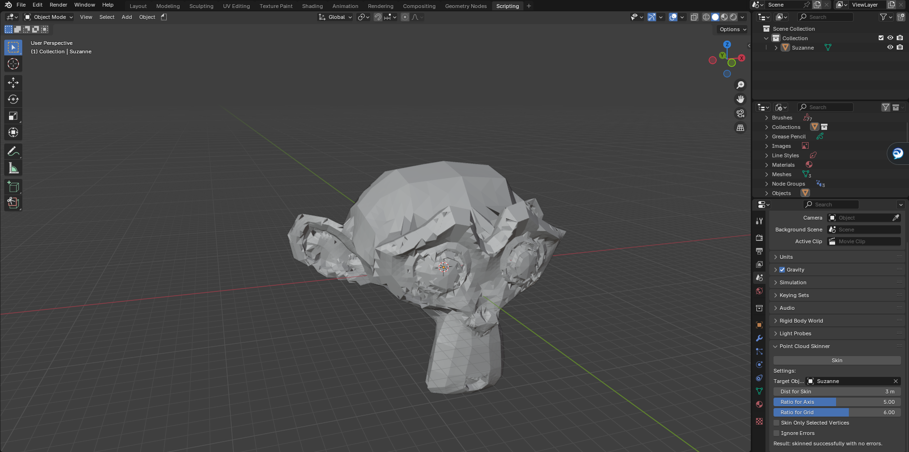

# Point Cloud Skinner for Blender 4.2

This script is an adaptation of the original "Point Cloud Skinner" tool created by **Hans.P.G.**. It has been updated and restructured to work seamlessly with Blender 4.2.

## Overview

The script is designed to create a "skin" over a point cloud by generating mesh faces around the points. It uses advanced algorithms to manage vertices, edges, and faces, ensuring efficient and robust mesh generation.

## Features
- Supports both selected vertices or the entire point cloud.
- Advanced algorithms for face creation around vertices.
- Integrated error logging for debugging.
- Compatibility with the latest Blender Python API.

## Changes from the Original
- Updated API calls to align with Blender 4.2 standards.
- Improved error handling and debugging capabilities.
- Enhanced performance and modularity for better usability.

## Installation
1. Download the script file (`t26_PointCloudSkinner1_Umbrella.py`).
2. Go to Edit-->Preferences-->Add-ons.
3. On the top right corner of the window click on the down button.
4. Click on Install from Disk and select the python file.
5. Enable the script in the Blender Preferences window.
6. You will now find the add-on in the Scene properties tab under "Point Cloud Skinner"

## Interface
The tool appears under the `Properties > Scene` panel as **Point Cloud Skinner**. The interface provides the following options:
- **Target Object**: Specify the object to process.
- **Distance for Skin**: Define the maximum distance for vertex connections.
- **Ratio for Axis**: Set the ratio used for axis calculations.
- **Ratio for Grid**: Configure the size of the spatial grid used for vertex management.
- **Skin Only Selected Vertices**: Enable to process only selected vertices.
- **Ignore Errors**: Toggle to allow processing to continue despite errors.

## Interface Preview
Below is a preview of the "Point Cloud Skinner" interface as it appears in Blender:

## Author Credits
- **Original Author**: Hans.P.G.
- **Adaptation and Updates**: Paolo Colombo

---
